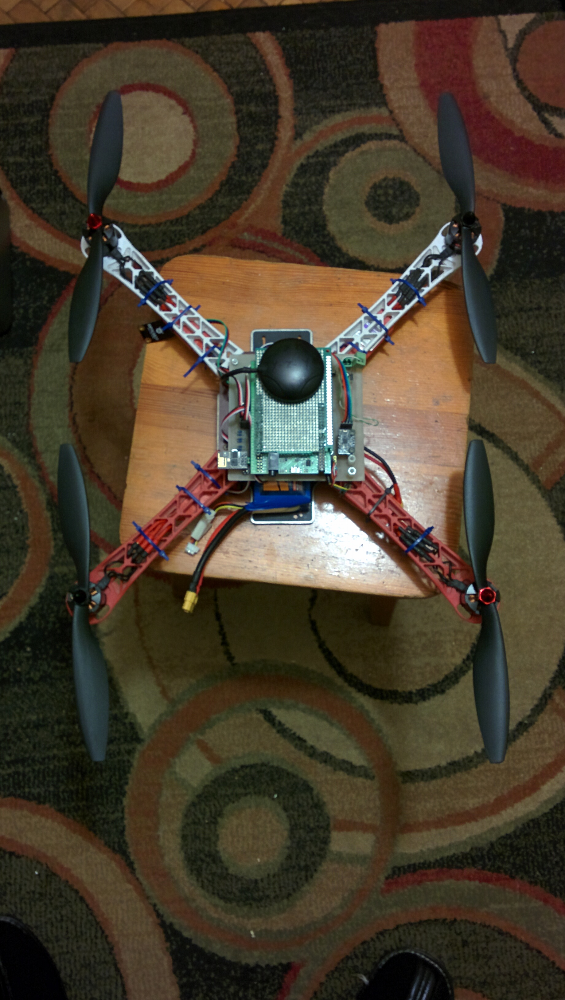

Quadcopter - work in progress
The Quadcopter control system was designed to work with the STM32F407 discovery board.
It utilizes:
- I2C to connect various sensor such as: MPU6050, BMP280, HMC5883L which are used to determine the state of the quadcopter
- UART to send telemetry data and receive command from the ground station via a ESP8266 WiFi card configured as server
- a timer to generate a PWM signal which is used to control the motors via ESC's
- freeRTOS to manage the timming dependencies

Quadcopter hardware 
